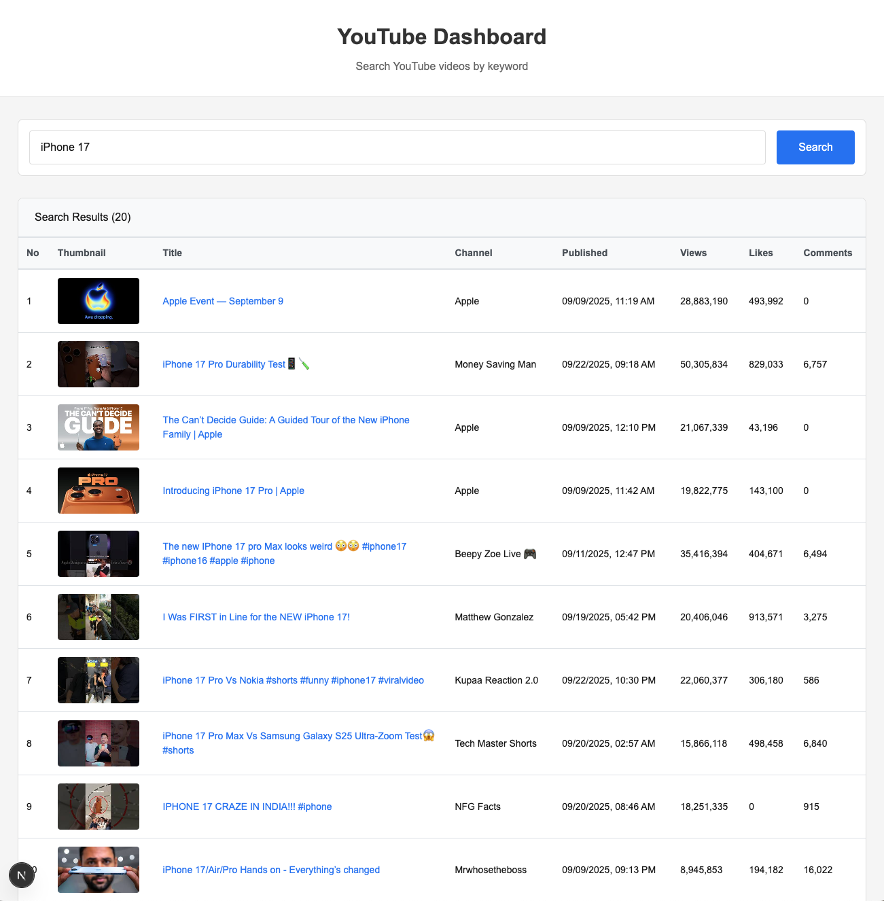

# YouTube Dashboard

A web-based dashboard for YouTube content creators to search and analyze videos using the YouTube Data API v3.

## Features

- **Video Search**: Search YouTube videos by keyword
- **Detailed Statistics**: View counts, likes, comments, and channel information
- **Real-time Data**: Fetch live data directly from YouTube API
- **Responsive Table**: Browse search results in an organized table format

## Tech Stack

- **Framework**: Next.js 14+ (App Router)
- **Language**: TypeScript
- **Styling**: CSS
- **API**: YouTube Data API v3

## Project Scope

This repository contains the **basic foundation** of the YouTube Dashboard. The complete version includes additional features:

### Additional Features (Not included in this repository)

- **Advanced Search Filters**: Multiple filter options and additional data columns
- **Channel Analysis Page**: In-depth channel statistics and performance metrics
- **Related Videos Page**: Discover videos similar to selected content
- **Search History**: Track and revisit previous searches
- **User Authentication**: Secure login and personalized experience
- **Database Integration**: PostgreSQL for data persistence
- **Tailwind CSS Styling**: Modern, responsive UI design

The basic version shared here provides the core architecture and can be extended with these features as needed.

## Getting Started

### Prerequisites

- Node.js 18+ installed
- YouTube Data API v3 key from Google Cloud Console

### Installation

1. Clone the repository:

```bash
git clone
cd youtube-dashboard
```

2. Install dependencies:

```bash
npm install
```

3. Create `.env.local` file in the root directory:

````bash
YOUTUBE_API_KEY=your_youtube_api_key_here
YOUTUBE_API_BASE_URL=https://www.googleapis.com/youtube/v3

### Run Development Server

```bash
npm run dev
````

## Usage

1. Enter a keyword in the search bar
2. Click "Search" button
3. View results in the table with:
   - Video thumbnails
   - Titles (clickable links to YouTube)
   - Channel names
   - Publication dates
   - View counts
   - Like counts
   - Comment counts


